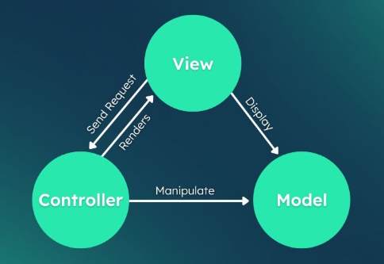

# Arquitectura del Sistema

Este documento describe la arquitectura implementada en **ApareCIó**, explicando cómo se organizan los distintos componentes del sistema y cómo interactúan entre sí.

La aplicación sigue el patrón **Modelo - Vista - Controlador (MVC)** en el backend, mientras que el frontend está desarrollado como una **Single Page Application (SPA)** utilizando React.

---

# Arquitectura General

<p align="center">
  
</p>

La solución está compuesta por tres capas principales:

* **Frontend (React)**
* **Backend (Node.js + Express)**
* **Base de datos (SQLite)**

La comunicación entre el cliente y el servidor se realiza mediante una **API REST**, utilizando solicitudes HTTP y respuestas en formato JSON.

---

# Frontend

El frontend fue desarrollado utilizando **React** y **Vite**, siguiendo una estructura basada en componentes reutilizables.

Sus responsabilidades principales son:

* Mostrar la interfaz de usuario.
* Gestionar la navegación de la aplicación.
* Validar datos básicos antes del envío.
* Enviar solicitudes a la API.
* Mostrar mensajes de éxito o error según la respuesta del servidor.

La lógica de comunicación con la API se encuentra encapsulada mediante **Hooks personalizados**, facilitando la reutilización del código y el mantenimiento del proyecto.

---

# Backend (MVC)

El backend utiliza una arquitectura **MVC (Model - View - Controller)** para separar claramente las responsabilidades de cada componente.

## Modelo (Model)

Los modelos son responsables del acceso a la base de datos.

Entre sus funciones se encuentran:

* Consultar registros.
* Insertar nuevos datos.
* Buscar coincidencias.
* Ejecutar consultas SQL parametrizadas.
* Gestionar la persistencia de la información.

Toda la interacción con SQLite se realiza desde esta capa.

---

## Controlador (Controller)

Los controladores contienen la lógica principal de la aplicación.

Sus responsabilidades incluyen:

* Recibir las solicitudes HTTP.
* Validar la información recibida.
* Generar el hash utilizado para el sistema de matching.
* Invocar los métodos correspondientes del modelo.
* Construir la respuesta enviada al cliente.

Los controladores funcionan como intermediarios entre la API y la base de datos.

---

## Rutas (Routes)

Las rutas definen los distintos endpoints de la API.

Cada ruta recibe la solicitud del cliente y la redirige al controlador correspondiente.

Esta separación facilita agregar nuevas funcionalidades sin modificar el resto del sistema.

---

# Base de Datos

La aplicación utiliza **SQLite** como sistema gestor de base de datos.

En ella se almacenan:

* Registros de cédulas encontradas.
* Hashes utilizados para la comparación.
* Información necesaria para establecer el contacto entre las partes.

La información se almacena únicamente cuando es necesaria para el funcionamiento del sistema.

---

# Flujo de Funcionamiento

El recorrido de una solicitud dentro del sistema es el siguiente:

```text
Usuario
    │
    ▼
Frontend (React)
    │
    ▼
API REST (Express)
    │
    ▼
Routes
    │
    ▼
Controller
    │
    ▼
Validación
    │
    ▼
Generación de Hash
    │
    ▼
Model
    │
    ▼
SQLite
    │
    ▼
Respuesta JSON
    │
    ▼
Frontend
```

---

# Validación de Datos

Antes de almacenar o consultar información, el backend realiza diferentes validaciones:

* Verificación de campos obligatorios.
* Validación del formato de la cédula.
* Validación del correo electrónico.
* Sanitización de datos de entrada.
* Manejo de errores para evitar información inconsistente.

Estas validaciones permiten mantener la integridad de la información y reducir posibles fallos durante el procesamiento.

---

# Organización del Proyecto

La estructura del backend se encuentra dividida en carpetas con responsabilidades específicas.

```text
backend/
│
├── controllers/
├── models/
├── routes/
├── database/
├── services/
├── cron/
├── utils/
└── server.js
```

Por su parte, el frontend organiza los componentes, hooks y servicios de manera independiente, favoreciendo la reutilización del código.

---

# Ventajas de la Arquitectura

La arquitectura implementada ofrece diversos beneficios:

* Separación clara de responsabilidades.
* Código modular y fácil de mantener.
* Reutilización de componentes y lógica.
* Facilidad para incorporar nuevas funcionalidades.
* Comunicación desacoplada mediante API REST.
* Mayor facilidad para realizar pruebas y depuración.

---

# Escalabilidad

La estructura actual permite incorporar nuevas funcionalidades sin modificar significativamente el proyecto existente.

Entre las posibles mejoras futuras se encuentran:

* Sistema de autenticación mediante JWT.
* Panel administrativo.
* Notificaciones automáticas por correo electrónico.
* Migración a una base de datos como PostgreSQL o MySQL.
* Contenerización mediante Docker.
* Despliegue en servicios cloud.
* Versionado de la API.
