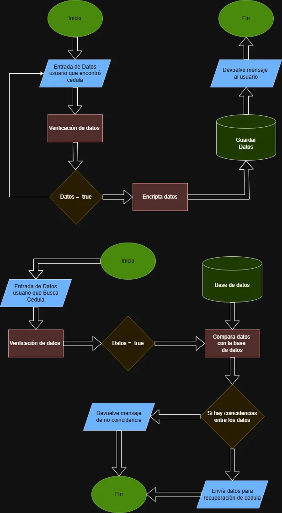

Flujo del Sistema

Descripción General

El sistema se divide en dos flujos principales:

Registro de una cédula encontrada
Búsqueda y verificación por parte del dueño

Ambos flujos están diseñados para garantizar:

Validación de datos
Protección mediante encriptación
Comparación segura sin exponer información sensible
Flujo 1: Registro de Cédula Encontrada
1. Inicio

El proceso comienza cuando un usuario encuentra una cédula e ingresa al sistema.

2. Entrada de Datos

El usuario proporciona información básica:

Ubicación aproximada
Fecha
Imagen (procesada posteriormente)
Datos mínimos necesarios
3. Verificación de Datos

El sistema valida:

Formato de los datos
Integridad de la información
Campos obligatorios

Si los datos no son válidos:

Se rechaza la solicitud
Se solicita corrección
4. Validación Exitosa

Si los datos son correctos:

Se continúa con el procesamiento
5. Encriptación de Datos

Antes de almacenar:

Los datos sensibles se transforman mediante hashing
No se guarda información en texto plano
6. Almacenamiento

Los datos ya protegidos se guardan en la base de datos.

7. Respuesta al Usuario

El sistema devuelve:

Confirmación de registro exitoso
ID del caso
8. Fin
Flujo 2: Búsqueda de Cédula Perdida
1. Inicio

El usuario que perdió su cédula accede al sistema.

2. Entrada de Datos

El usuario ingresa:

Datos personales necesarios para identificar su cédula
3. Verificación de Datos

Se valida:

Formato correcto
Consistencia de los datos

Si los datos no son válidos:

Se rechaza la solicitud
4. Validación Exitosa

Si los datos son correctos:

Se continúa al proceso de comparación
5. Comparación con la Base de Datos

El sistema:

Aplica el mismo proceso de hashing a los datos ingresados
Compara contra los registros almacenados
6. Evaluación de Coincidencias
Caso 1: No hay coincidencias
Se informa al usuario que no se encontraron resultados
Finaliza el proceso
Caso 2: Hay coincidencias
Se identifica el registro correspondiente
Se habilita el proceso de recuperación
7. Envío para Recuperación

El sistema:

Facilita el contacto entre ambas partes
Sin exponer datos sensibles directamente
8. Fin
Consideraciones de Seguridad en el Flujo
Todos los datos sensibles son procesados antes de almacenarse
La comparación se realiza sobre datos encriptados
No existe exposición pública de información personal
La validación ocurre antes de cualquier operación crítica