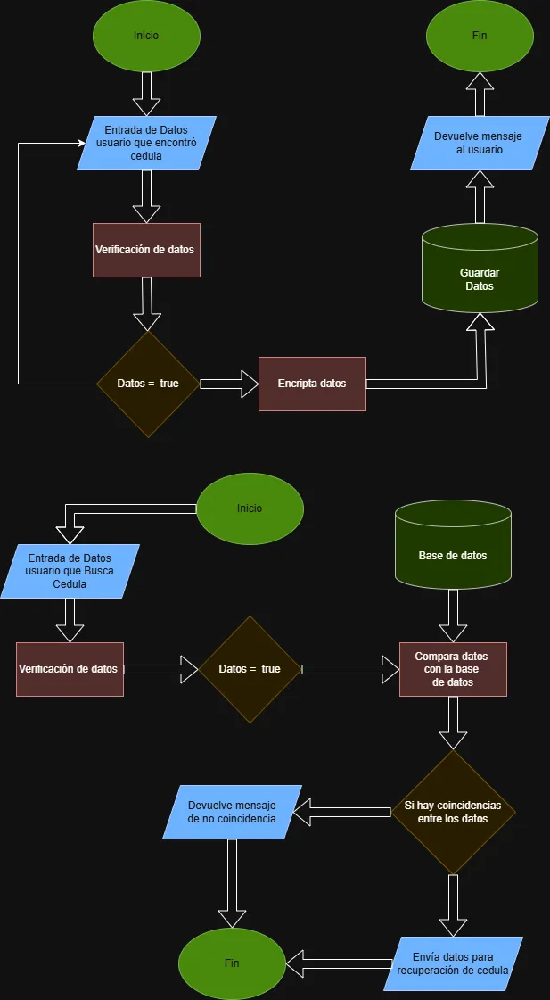

# Flujo del Sistema

<p align="center">
  
</p>

## Descripción General

El funcionamiento de **ApareCIó** se basa en dos procesos principales:

* Registro de una cédula encontrada.
* Búsqueda de una cédula perdida.

Ambos procesos utilizan el mismo mecanismo de validación y comparación segura mediante **HMAC-SHA256**, garantizando que la información sensible no sea utilizada directamente durante el proceso de búsqueda.

---

# Flujo 1: Registro de una Cédula Encontrada

## 1. Acceso al formulario

La persona que encuentra una cédula completa el formulario correspondiente desde la aplicación web.

Los datos solicitados incluyen:

* Número de cédula.
* Nombre.
* Correo electrónico de contacto.
* Lugar donde fue encontrada.

---

## 2. Validación de los datos

Antes de procesar la información, el servidor verifica:

* Campos obligatorios.
* Formato correcto de la cédula.
* Formato válido del correo electrónico.
* Integridad de los datos recibidos.

Si alguna validación falla, la solicitud es rechazada y se devuelve un mensaje de error.

---

## 3. Generación del Hash

Una vez validados los datos, el sistema genera un **HMAC-SHA256** utilizando la información necesaria para el proceso de coincidencia y una clave secreta almacenada en variables de entorno.

Este hash será el identificador utilizado posteriormente para comparar registros.

---

## 4. Almacenamiento

El backend almacena en SQLite la información necesaria junto con el hash generado.

---

## 5. Búsqueda de coincidencias

Después del registro, el sistema verifica automáticamente si existe una solicitud previa correspondiente a esa misma cédula.

* Si existe una coincidencia, el proceso de matching finaliza exitosamente.
* Si no existe, el registro queda almacenado para futuras consultas.

---

## 6. Respuesta al cliente

La API devuelve una respuesta indicando si el registro fue realizado correctamente y si se encontró o no una coincidencia.

---

# Flujo 2: Búsqueda de una Cédula Perdida

## 1. Acceso al formulario

La persona que perdió su cédula ingresa sus datos desde el formulario de búsqueda.

---

## 2. Validación

El servidor verifica que la información recibida sea válida.

Se controlan:

* Campos obligatorios.
* Formato de la cédula.
* Consistencia de los datos.

---

## 3. Generación del Hash

Se aplica exactamente el mismo algoritmo **HMAC-SHA256** utilizado durante el registro de la cédula encontrada.

De esta forma ambos registros generan el mismo identificador cuando corresponden a la misma persona.

---

## 4. Comparación

El sistema consulta la base de datos y compara el hash generado con los hashes previamente almacenados.

---

## 5. Resultado

### Existe coincidencia

Cuando los hashes coinciden, el sistema identifica que ambas solicitudes corresponden a la misma cédula y devuelve una respuesta positiva.

### No existe coincidencia

Si no se encuentra ningún registro compatible, la solicitud finaliza indicando que actualmente no existen coincidencias.

---

# Flujo General del Sistema

```text
Usuario
   │
   ▼
Formulario (React)
   │
   ▼
API REST
   │
   ▼
Validación
   │
   ▼
Generación HMAC-SHA256
   │
   ▼
SQLite
   │
   ├──────────────┐
   ▼              │
Comparación Hash  │
   │              │
   └──────► Match?
                │
        ┌───────┴────────┐
        ▼                ▼
  Coincidencia      Sin coincidencia
        │                │
        ▼                ▼
Respuesta JSON      Respuesta JSON
```

---

# Medidas de Seguridad durante el Flujo

Durante todo el procesamiento se aplican medidas de protección para preservar la privacidad de los usuarios.

Entre ellas:

* Validación de todas las solicitudes antes de acceder a la base de datos.
* Generación de hashes mediante **HMAC-SHA256**.
* Uso de una clave secreta almacenada en variables de entorno.
* Consultas SQL parametrizadas.
* Manejo controlado de errores.
* Eliminación automática de registros antiguos mediante tareas programadas.

---

# Resumen del Proceso

1. El usuario envía la información desde el frontend.
2. El backend valida todos los datos recibidos.
3. Se genera el hash criptográfico correspondiente.
4. El sistema consulta la base de datos.
5. Se compara el hash con los registros existentes.
6. La API devuelve una respuesta indicando si existe o no una coincidencia.

Este flujo permite realizar el proceso de recuperación de una cédula de forma segura, manteniendo la separación entre la interfaz de usuario, la lógica del servidor y el almacenamiento de la información.
